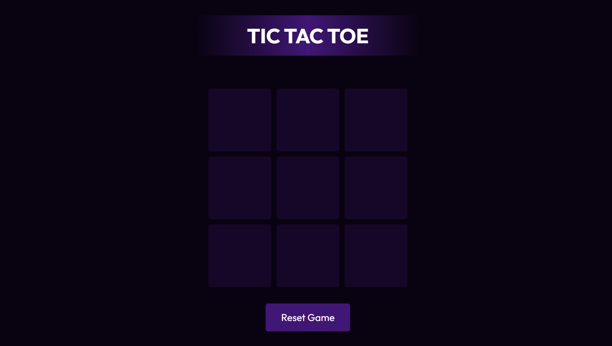

# Tic Tac Toe Game

Welcome to the Tic Tac Toe Game repository! This project is a JavaScript-based web application designed to play the classic Tic Tac Toe game. Built with HTML, CSS, and JavaScript, it features a modern UI design for an enjoyable gaming experience. The game displays winning and draw messages to enhance the user experience.

## Preview



## Features

- **Classic Tic Tac Toe:** Play the classic game with a modern twist.
- **Winning Messages:** Receive messages when a player wins the game.
- **Draw Message:** Get notified in case of a draw.
- **Modern UI Design:** Sleek layout and visually appealing design for an immersive gaming interface.

## Getting Started

To run the Tic Tac Toe Game locally, follow these steps:

1. Clone the repository to your local machine:

   ```bash
   git clone https://github.com/Devsethi3/Tic-Tac-Toe-Game.git
   ```

2. Open the `index.html` file in your preferred web browser.

## Usage

1. Click on the empty cells to make your move.
2. Play against a friend or against the computer.
3. The game will display winning and draw messages accordingly.

## Customization

Feel free to customize this project to fit your preferences. Update styles, colors, and layout in the HTML and CSS files. You can also extend the functionality to include additional features or customization options.

## Contributing

If you'd like to contribute to this project, please follow these steps:

1. Fork the repository.
2. Create a new branch for your feature or improvement.
3. Make your changes and commit them with descriptive messages.
4. Push your changes to your forked repository.
5. Open a pull request to merge your changes into the main branch.

Explore the Tic Tac Toe Game, have fun playing, and consider contributing to its development. Thank you for checking out the repository!